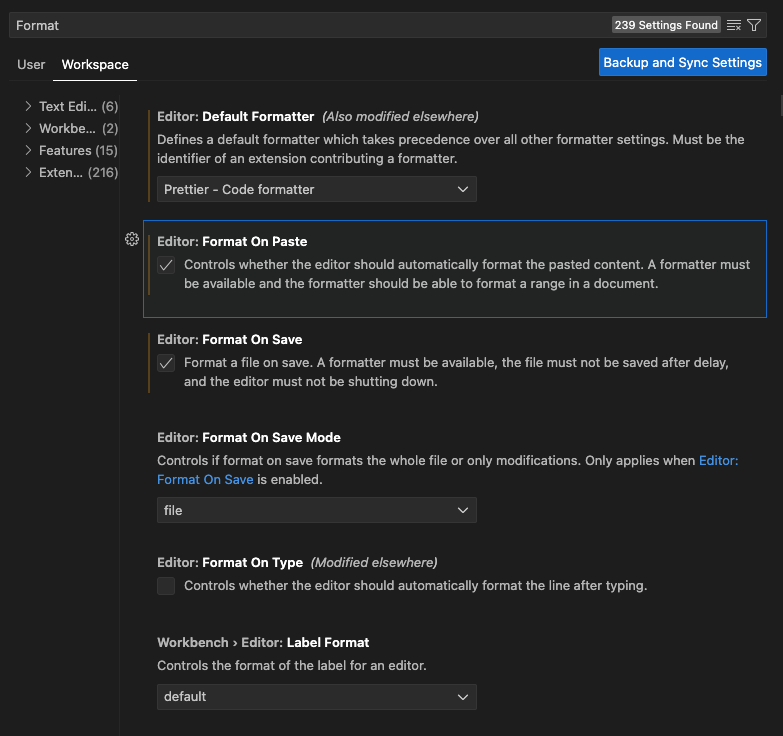

# Welcome to Frontend Coding!

This project was bootstrapped with [Create React App](https://github.com/facebook/create-react-app).

## Getting started

(If you are using yarn instead of npm, you can simply change `npm` to `yarn`)

First, you should first install all the dependency by (suppose you are in the root folder `/SECURE_MUSIC_STORAGE`):

```shell
# important! Don't do that in the root folder and submit useless files to github.
cd frontend
npm install
```

Then heare are serveral commands for you. You can also add scripts in `package.json`.

### `npm start`

This is for developing.

Runs the app in the development mode.\
Open [http://localhost:3000](http://localhost:3000) to view it in your browser.

The page will reload when you make changes.\
You may also see any lint errors in the console.

### `npm test`

Launches the test runner in the interactive watch mode.\
See the section about [running tests](https://facebook.github.io/create-react-app/docs/running-tests) for more information.

### `npm run build`

Builds the app for production to the `build` folder.\
It correctly bundles React in production mode and optimizes the build for the best performance.

The build is minified and the filenames include the hashes.\
Your app is ready to be deployed!

See the section about [deployment](https://facebook.github.io/create-react-app/docs/deployment) for more information.

### `npm run eject`

**Note: this is a one-way operation. Once you `eject`, you can't go back!**

If you aren't satisfied with the build tool and configuration choices, you can `eject` at any time. This command will remove the single build dependency from your project.

Instead, it will copy all the configuration files and the transitive dependencies (webpack, Babel, ESLint, etc) right into your project so you have full control over them. All of the commands except `eject` will still work, but they will point to the copied scripts so you can tweak them. At this point you're on your own.

You don't have to ever use `eject`. The curated feature set is suitable for small and middle deployments, and you shouldn't feel obligated to use this feature. However we understand that this tool wouldn't be useful if you couldn't customize it when you are ready for it.

### `npm run format`

Format your code.

## Coding standard

We use eslint for code quality, prettier for formatting.
There are 2 ways for you to format your code:

1. run `npm run format` or `yarn format` at `/fronted`.
2. Install prettier in your vscode, and set it as the formatter of your vscode. Then, the code will be automatically formatted every time you save. (Recommend)
   

## Code Structure

All the public components which can be used in multiple pages are in `src/components`. For example, `NavBarNoLogin` and `Footer`.

All the public components which can be used in multiple pages are in `src/components`. For example, `LogInView`.

There is a `style` folder in both `components` and `pages` to store all the css. We recommend you to use [Module CSS](https://create-react-app.dev/docs/adding-a-stylesheet) to avoid name conflicts in different css. We adopt [sass](https://create-react-app.dev/docs/adding-a-sass-stylesheet) to allow variables and nested css.

### ⚠️ How to create a new page

If you want to create a new page, remember to register it to the router in `App.js`.

**If your page can only be accessed after login**, remember to wrap it in the `RequireAuth` component:

```javascript
<Route
  path="/personalProfile"
  element={
    <RequireAuth>
      <PersonalProfile />
    </RequireAuth>
  }
/>
```

By doing that, if you want to goto '/personalProfile' without login, you will be redirect to the home page.

### ⚠️ How to access the user information

All the authentication components are wrapped in the context, including current user, and logIn, logOut, signUp method.
Here is an example:

```javascript
import { useAuth } from "../contexts/AuthContext";
const { user } = useAuth();
if(!user){
  return (<div>user do not exsit.</div>)
}
return (<div> {JSON.stringify(user)} </div>);
```

## Git Standard

Since we are responsible for different pages, we use a single branch development model. All the changes are on the same branch. So, **remember to pull often!**

If you add some new features, use "feat: \<your added features\>" for commitment. If you fix some bugs, use "fix: \<what you fix\>" for commitment.


## Request(API) components
Need to implement.

## Learn More

You can learn more in the [Create React App documentation](https://facebook.github.io/create-react-app/docs/getting-started).

To learn React, check out the [React documentation](https://reactjs.org/).

### Code Splitting

This section has moved here: [https://facebook.github.io/create-react-app/docs/code-splitting](https://facebook.github.io/create-react-app/docs/code-splitting)

### Analyzing the Bundle Size

This section has moved here: [https://facebook.github.io/create-react-app/docs/analyzing-the-bundle-size](https://facebook.github.io/create-react-app/docs/analyzing-the-bundle-size)

### Making a Progressive Web App

This section has moved here: [https://facebook.github.io/create-react-app/docs/making-a-progressive-web-app](https://facebook.github.io/create-react-app/docs/making-a-progressive-web-app)

### Advanced Configuration

This section has moved here: [https://facebook.github.io/create-react-app/docs/advanced-configuration](https://facebook.github.io/create-react-app/docs/advanced-configuration)

### Deployment

This section has moved here: [https://facebook.github.io/create-react-app/docs/deployment](https://facebook.github.io/create-react-app/docs/deployment)
